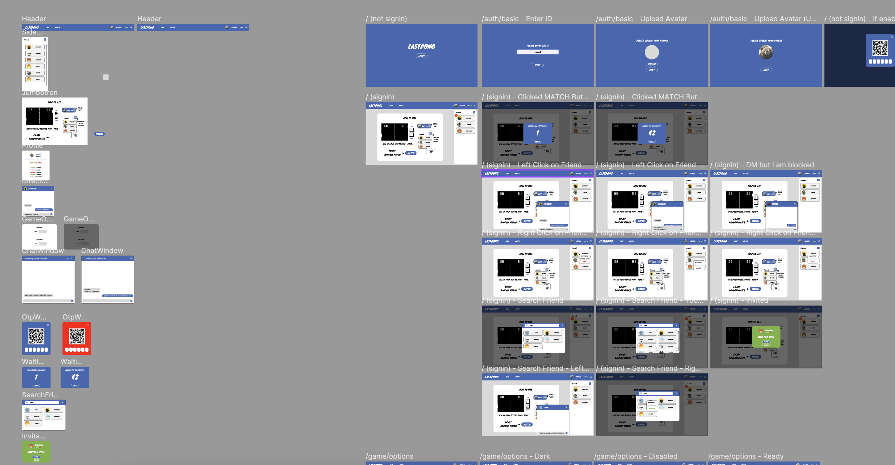
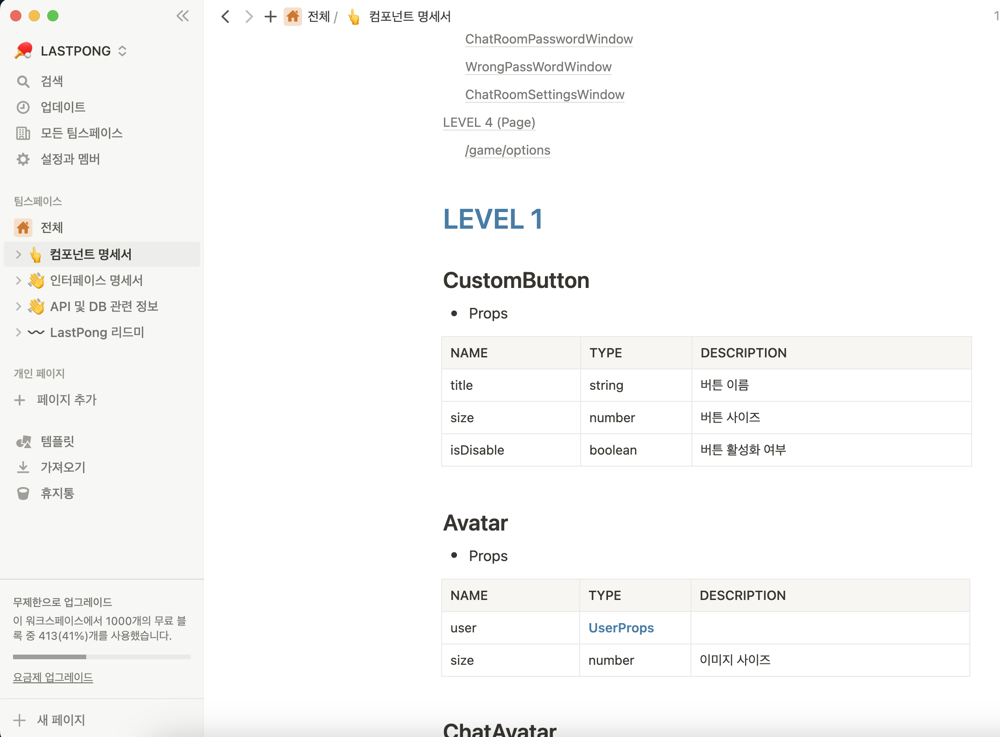
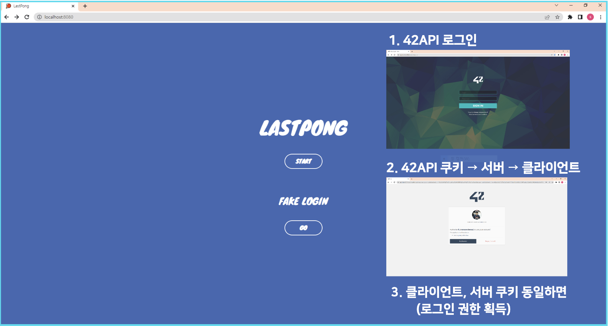

# LastPong 🏓

<p align="center"></p>

<div align="center">
<b><i>우리들의 마지막 탁구 게임, LastPong</i></b>
<p>2023.01. 제작 완료</p>
</div>

> 42서울 공통과정 마지막 과제 `ft_transcendence` 결과물입니다 🙂

## ☝️ 프로젝트 소개

- `Socket.io`를 이용하여 게임, 채팅, DM을 구현한 SPA 웹서비스
- `42 Auth`를 이용하여 42 유저 대상으로 가입 및 인증 기능 구현
- 유저 생성, 친구 맺기, 친구 차단 등 CRUD 연습

## 🎨 기획/디자인


자세한 디자인 시안은 [해당 링크](https://www.figma.com/community/file/1199421293253949642)에서 볼 수 있습니다.


팀 노션 / 슬랙 등을 활용하여 협업 및 문서화하였습니다.

## 🙂API / DB
[API 문서와 DB 설계 구조](https://secret-jackal-406.notion.site/backend-API-DB-7cde6bb436ff4398807157fbbc1e079c)

## 💡 구현 중점 사항

- 발생할 수 있는 **다양한 경우의 수를 생각하고 대응하기**

  - [x] 게임 중간에 나갔을 때 상대방 게임 종료 및 알림 보내기
  - [x] 비로그인 유저가 서비스 내 접근하지 못하도록 하기
  - [x] 채팅 Owner/Admin 권한 부여에서 발생하는 다양한 케이스 처리하기

- **결코 UI를 포기하지 않기**
  - [x] 초대, 게임 결과 등 화면에서 모달창 적극 활용하기
  - [x] Facebook, Instagram처럼 메인에서 DM 팝오버 가능하도록 제작하기
  - [x] 탁구 게임 화면 UI를 고전적인 느낌 나도록 만들기

## ⚙️ 설치 및 배포 방법

```bash
$ git clone https://github.com/lev-Zero/lastpong
$ cd lastpong/
# 아래 환경설정 체크
$ docker-compose up -d
```

### localhost 이외의 주소로 배포할 때 수정해야 할 부분

- docker/backend.env의 `CALLBACK_URI`, `FRONTEND_URL`
- frontend/package.json의 `proxy`
- frontend/src/utils/variables.ts의 `SERVER_URL`과 `WS_SERVER_URL`
- 42 OAuth 다른 걸로 이용하는 경우, docker/backend.env의 `UID`, `SECRET` 값도 변경해주어야 함

## 🛠 기술 스택

<table border="1" align="center">
  <th align="center">파트</th>
  <th align="center">기술스택</th>
  <th align="center">선정이유</th>
  <tr>
    <td rowspan="3" align="center">Common</td>
    <td> TypeScript</td>
    <td>Type 안정성을 보장하여 런타임 에러 방지</td>
  </tr>
  <tr>
    <td> Prettier</td>
    <td>코드 스타일 정형화를 통한 협업 능률 향상</td>
  </tr>
  <tr>
    <td> Socket.io</td>
    <td>실시간 채팅 및 게임 기능 구현을 위해 HTTP 통신이 아닌 소켓 통신 필요</td>
  </tr>
  <tr>
    <td rowspan="3" align="center">Frontend</td>
    <td> Next.js</td>
    <td> <code>Zero Config</code> : Webpack 및 Babel 설정 없이 빌트인으로 Code Splitting 및 JS 번들링 <br/> <code>File-system Routing</code> : pages 기반 라우팅으로 디렉토리 구조 직관성 확보</td>
  </tr>
  <tr>
    <td> Chakra UI</td>
    <td>프리메이드 컴포넌트와 유틸리티를 이용한 손쉬운 UI 제작</td>
  </tr>
  <tr>
    <td>🐻 Zustand</td>
    <td>배우기 쉽고 단순한 구조의 상태관리 모듈, 불필요한 리렌더링 방지에 용이함</td>
  </tr>
  <tr>
    <td rowspan="4" align="center">Backend</td>
    <td> NestJS</td>
    <td> <code>DI</code> : 의존관계를 분리하여 수정 및 재사용이 용이함 <br/> <code>IoC</code> : 컴포넌트와 모듈에 집중한 프로그래밍 가능, 유지보수 또는 확장시 편리</td>
  </tr>
  <tr>
    <td> PostgreSQL</td>
    <td>영구 무료인 오픈소스, 참고할 자료가 많고 다양함</td>
  </tr>
  <tr>
    <td> TypeORM</td>
    <td>RDBMS의 데이터 구조와 객체지향 모델 사이의 간격을 줄여 생산성 증가</td>
  </tr>
  <tr>
    <td> Passport</td>
    <td>42 Auth 인증 기능 간편화</td>
  </tr>
  <tr>
    <td rowspan="1" align="center">Infra</td>
    <td> Docker-compose</td>
    <td> 컨테이너를 이용한 가상환경 구성 및 빌드 자동화</td>
  </tr>
</table>

## 🏁 튜토리얼

1. LAST PONG (로그인)



2-1. 사용자 설정 (닉네임 설정)


2-2. 사용자 설정 (아바타 설정)

(사진 파일) Front → Back 전송


3. 메인화면


3-1. 메인 화면 (기능 설명)


4-1. 게임 플레이

MATCH 버튼 클릭시 서버 Queue에 등록되고 플레이어가 2명이상 될 경우 설정화면으로 이동


4-2. 게임 플레이 (설정 화면)


4-3. 게임 설정 규칙


4-4. 게임 플레이 화면

일반 모드


어두운 화면 모드


4-5. 게임 플레이 (승리)


게임 플레이 (패배)


5. 사용자 정보 표시


5-1. 사용자 친구 초대

친구 초대 버튼시 서버에 등록된 모든 유저 정보를 유저 상태에 따라 표시


5-2. 사용자 친구 초대창

친구 초대창에서 일반 유저 선택시 유저 프로필이 표시 된다.


- `ADD FRIEND` 버튼 클릭 → 오른 쪽에 있는 친구 창에 친구가 추가된다.
- `DELETE FRIEND` 버튼 클릭 → 추가된 친구를 삭제한다.

5-3. 사용자 친구 창


추가한 친구를 오른쪽 클릭시 다음과 같은 메뉴 화면이 표시된다.

- `VIEW PROFILE` : 친구의 프로필 정보 확인
- `INVITE TO GAME` : 친구를 핑퐁 게임에 초대한다. - 게임 Queue 와 별도로 동작한다.
- `DELETE FRIEND` : 친구를 삭제한다.

5-4. 친구 창 DM (Direct Message)

친구 창에 있는 친구를 왼쪽 클릭하면 친구와의 DM 창이 표시된다.


친구와 함께 DM을 주고 받을수 있다.


친구에게 DM을 받게되면 DM 메시지의 갯수가 따라 친구 창에 표시된다.


5-5. 사용자 게임 초대 화면


친구에게 INVITE TO GAME 메시지를 사용하면 게임 초대 화면이 표시된다.

초대 받은 친구의 선택에 따라 다음과 같은 행동이 실행된다.

- 초대 수락 : 게임 설정 창으로 이동된다.
- 초대 거절 : 초대 창이 자동으로 종료된다.

6. 채팅 화면


현재 접속된 모든 유저 정보를 출력하고, CREATE 버튼을 클릭하여 채팅방을 생성할 수 있습니다.

비밀번호를 설정할 수 있으며, 비밀번호의 표시를 `*`로 바꿔 출력할 수 있습니다.

6.1 채팅방 입장


채팅방에 입장하면 다음과 같은 화면이 표시되며 사용자들과 대화가 가능합니다.


방에 입장해서 방장 > 관리자 > 일반 수준으로 권한을 갖는다.

- `MUTE 1 MIN` : 1분간 사용자의 대화를 MUTE 시킵니다.
- `BAN USER` : 사용자를 강퇴 시키고 1분간 입장을 제한시킵니다.
- `VIEW PROFILE` : 사용자의 프로필을 볼수 있습니다.
- `INVITE TO GAME` : 게임에 상대를 초대합니다
- `ADD FRIEND` : 상대를 친구로 추가합니다
- `BLOCK` : 상대를 BLOCK 하여 상대방의 메시지를 더이상 보지않습니다.


MUTE 된 상태에서 메시지를 입력하려고 하면 다음과 같은 화면이 표시됩니다.

## 👋 팀 정보

| Name   | Github ID                                                                                                                                                                | Role     |
| ------ | ------------------------------------------------------------------------------------------------------------------------------------------------------------------------ | -------- |
| 박용준 | <a href="https://github.com/yoopark" target="_blank"></a>          | FrontEnd |
| 문치훈 | <a href="https://github.com/lev-Zero" target="_blank"></a>       | FrontEnd |
| 최선빈 | <a href="https://github.com/choi-sunbin" target="_blank"></a> | FrontEnd |
| 이정환 | <a href="https://github.com/toy-k" target="_blank"></a>             | BackEnd  |
